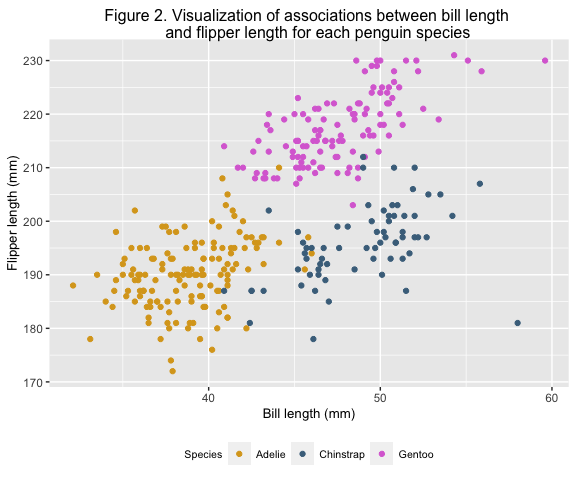
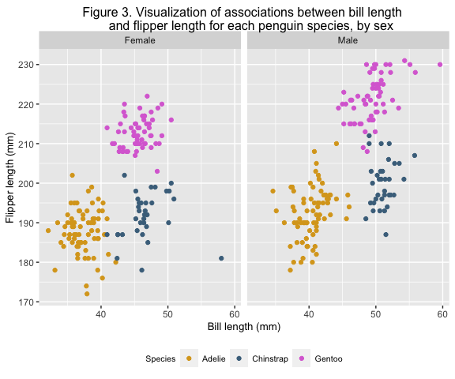

PUBH 7462 Week 2 Homework
================
Kristin Elgersma
2/3/22

-   [Problem 2. Best Practices and Consistent
    Style](#problem-2-best-practices-and-consistent-style)

# Problem 2. Best Practices and Consistent Style

## 2.1 Independent Bivariate Normal Random Sample

``` r
# Create variable vectors
x <- c(rnorm(1000, 0, 1))
y <- c(rnorm(1000, 1, 2))
sum_indicator <- c(ifelse((x + y > 0.5), "TRUE", "FALSE"))

# Add to data frame
dat <- tibble(x, y, sum_indicator)

# Rename and relevel sum_indicator variable
dat <- dat %>% mutate(
  sum_indicator = factor(sum_indicator),
  sum_indicator = fct_recode(sum_indicator,
    "Yes" = "TRUE", "No" = "FALSE"
  ),
  sum_indicator = fct_relevel(sum_indicator, "Yes", "No")
)

# Create scatterplot of y ∼ x, colored by the sum_indicator
dat %>%
  ggplot(aes(x = x, y = y, color = sum_indicator)) +
  geom_point() +
  labs(
    title = "Figure 1. Visualization of y ~ x, grouped by whether
    the outcome is greater than 0.5",
    x = "X ~ N(0, 1)", y = "Y ~ N(1,2)"
  ) +
  scale_color_manual(
    values = c("goldenrod", "skyblue4"),
    name = "X + Y > 0.5", labels = c("Yes", "No")
  ) +
  theme(
    axis.title = element_text(size = 10), 
    plot.title = element_text(size = 12),
    legend.text = element_text(size = 8), 
    legend.title = element_text(size = 10)
  )
```


## 2.2 Penguin EDA

``` r
# Read data with relative path
penguin.df <- read_rds("./data/penguin.RDS")
```

### 2.2.1 Data Description

1.  **Case definition**: In the penguins data set, each case is defined
    as an observation of 1 adult foraging penguin located near Palmer
    Station, Antarctica.

2.  **Number of observations**: 344

3.  **Number of variables**: 8

4.  **Variable names and definitions**:

-   species: A factor denoting penguin species (Adélie, Chinstrap and
    Gentoo)
-   island: A factor denoting island in Palmer Archipelago, Antarctica
    (Biscoe, Dream or Torgersen)
-   bill_length_mm: A number denoting bill length (millimeters)
-   bill_depth_mm: A number denoting bill depth (millimeters)
-   flipper_length_mm: An integer denoting flipper length (millimeters)
-   body_mass_g: An integer denoting body mass (grams)
-   sex: A factor denoting penguin sex (female, male)
-   year: An integer denoting the study year (2007, 2008, or 2009)

5.  **Flipper length in mm - mean (SD)**: 200.92 (14.06)

6.  **Bill length in mm - mean (SD)**: 43.92 (5.46)

### 2.2.2 Visualization

``` r
# Create scatterplot of flipper length (y) by bill length (x), coloured by species
penguin_gg <- penguin.df %>%
  filter(!is.na(sex)) %>%
  mutate(
    sex = factor(sex),
    sex = fct_recode(sex, "Female" = "female", "Male" = "male")
  ) %>%
  ggplot(aes(x = bill_length_mm, y = flipper_length_mm, color = species, na.rm = TRUE)) +
  geom_point()

# Add labels, color, font sizes
penguin_gg +
  labs(
    title = "Figure 2. Visualization of associations between bill length 
    and flipper length for each penguin species",
    x = "Bill length (mm)", y = "Flipper length (mm)"
  ) +
  scale_color_manual(
    values = c("goldenrod", "skyblue4", "orchid"),
    name = "Species"
  ) +
  theme(
    axis.title = element_text(size = 10), 
    plot.title = element_text(size = 12), 
    legend.text = element_text(size = 8), 
    legend.title = element_text(size = 8)
)
```



``` r
# Create new plot, faceted by sex
penguin_gg +
  labs(
    title = "Figure 3. Visualization of associations between bill length 
    and flipper length for each penguin species, by sex",
    x = "Bill length (mm)", y = "Flipper length (mm)"
  ) +
  scale_color_manual(
    values = c("goldenrod", "skyblue4", "orchid"),
    name = "Species"
  ) +
  theme(
    axis.title = element_text(size = 10), 
    plot.title = element_text(size = 12), 
    legend.text = element_text(size = 8), 
    legend.title = element_text(size = 8)
  ) +
  facet_grid(~sex)
```



**Data trends**: In general, lower bill length appears to be associated
with lower flipper length. Data points for each species are grouped
closely together. Gentoo penguins tend to have the longest flipper
length, while Adelie penguins tend to have the shortest bill length.
Female penguins tend to have slightly shorter bill and flipper length
than male penguins.
