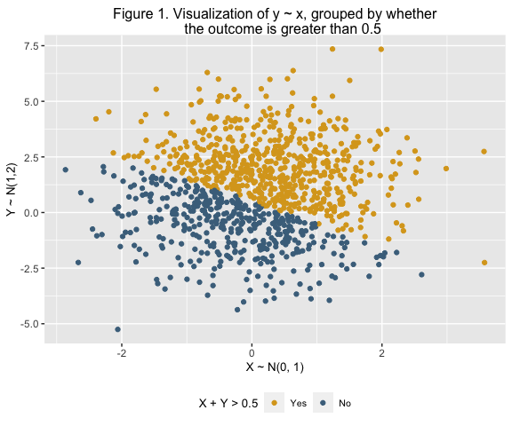

PUBH 7462 Week 2 Activity
================
Kristin Elgersma
2/3/22

-   [1. Best Practices and Consistent
    Style](#1-best-practices-and-consistent-style)

# 1. Best Practices and Consistent Style

## 2.1 Independent Bivariate Normal Random Sample

``` r
# Create variable vectors
x <- c(rnorm(1000, 0, 1))
y <- c(rnorm(1000, 1, 2))
sum_indicator <- c(ifelse((x + y > 0.5), "TRUE", "FALSE"))

# Add to data frame
dat <- tibble(x, y, sum_indicator)

# Rename and relevel sum_indicator variable
dat <- dat %>% mutate(sum_indicator = factor(sum_indicator),
                      sum_indicator = fct_recode(sum_indicator, 
                                                 "Yes" = "TRUE", "No" = "FALSE"),
                      sum_indicator = fct_relevel(sum_indicator,"Yes", "No"))

# Create scatterplot of y ∼ x, coloured by the sum_indicator
dat %>%
  ggplot(aes(x = x, y = y, color = sum_indicator)) +
  geom_point() +
  labs(title = "Figure 1. Visualization of y ~ x, grouped by whether the outcome is greater than 0.5", 
       x = "X ~ N(0, 1)", y = "Y ~ N(1,2)") +
  scale_color_manual(values = c("goldenrod", "skyblue4"), 
                     name = "X + Y > 0.5", labels = c("Yes", "No")) +
  theme(axis.title=element_text(size = 10), plot.title = element_text(size = 12), 
        legend.text = element_text(size = 8), legend.title = element_text(size = 10))
```



### 1.1.1 Sub-subheading

-   List
    -   *italics*  
    -   **bold**

1.  Numbered list
    -   Bullet  

    2.  Number

### 1.1.2 R chunk

``` r
#Store object
eulers_no <- exp(1)
```

### 1.2.3 Inline R

Given the `options(digits = 4)` in the setup R chunk, it follows that
the 4 digits approximation to Euler’s number (*e*) can be expressed with
inline R as *e*≈ 2.7183.
